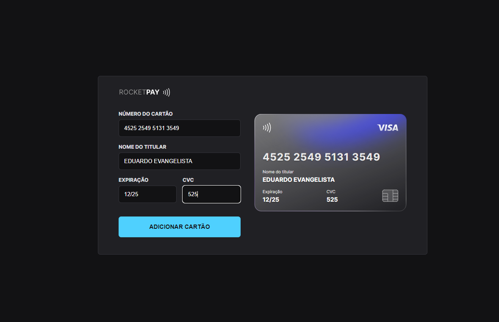

<h1 align="center"> Credit Card 💳 </h1>

Formulário de preenchimento de cartão de crédito

  <a href="#-tecnologias">Tecnologias</a>&nbsp;&nbsp;&nbsp;|&nbsp;&nbsp;&nbsp;
  <a href="#-projeto">Projeto</a>&nbsp;&nbsp;&nbsp;&nbsp;&nbsp;&nbsp;
 

 

  
  

  

 

🔗[Clique aqui para acessar](https://credit-card-pi.vercel.app/)

## 🛠 Tecnologias

Esse projeto foi desenvolvido com as seguintes tecnologias:

- HTML e CSS
- JavaScript e JSON
- Node e NPM
- Vite
- [iMask](https://imask.js.org)

## 💻 Projeto

Projeto inicialmente criado com o bundler Vite utilizando as funcionalidades de máscara para os campos do formulário, iMask como biblioteca e expressões regulares do JavaScript para construir uma interface de usuário. 
Eventos para atualizar elementos HTML com a DOM.
Vercel para publicação do site

Criado no evento da Rocketseat

